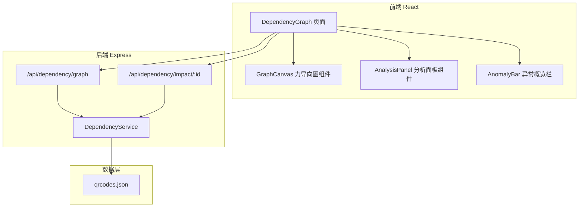

## 1. 架构设计



## 2. 技术说明

- 前端：React@18 + TailwindCSS@3 + Vite
- 图谱渲染：Canvas 2D 自定义力导向布局（无额外依赖）
- 后端：Express@4 + TypeScript ESM
- 数据：JSON 文件存储（沿用现有 JsonRepository）

## 3. 路由定义

| 路由 | 用途 |
|------|------|
| `/dependency` | 依赖图谱分析页面 |

## 4. API 定义

### 4.1 GET /api/dependency/graph

获取完整依赖图谱数据

响应类型：
```typescript
interface DependencyGraph {
  nodes: GraphNode[]
  edges: GraphEdge[]
  cycles: string[][]        // 循环引用的节点ID组
  orphanIds: string[]       // 孤立节点ID列表
  brokenEdges: GraphEdge[]  // 断链引用边
}

interface GraphNode {
  id: string
  name: string
  shortCode: string
  targetUrl: string
  type: QrCodeType
  enabled: boolean
  scanCount: number
  indegree: number    // 被引用次数
  outdegree: number   // 引用其他次数
  anomalyType?: 'cycle' | 'orphan' | 'broken'
}

interface GraphEdge {
  source: string   // 引用方 QR码ID
  target: string   // 被引用方 QR码ID
  broken: boolean  // 是否断链（目标不存在）
}
```

### 4.2 GET /api/dependency/impact/:id

获取指定节点的影响范围分析

响应类型：
```typescript
interface ImpactAnalysis {
  node: GraphNode
  upstreamIds: string[]      // 直接上游
  downstreamIds: string[]    // 直接下游
  allDownstreamIds: string[] // 级联下游（递归）
  allUpstreamIds: string[]   // 级联上游（递归）
  cascadePaths: string[][]   // 级联路径
  suggestions: CascadeSuggestion[]
}

interface CascadeSuggestion {
  type: 'update' | 'delete' | 'redirect'
  affectedIds: string[]
  description: string
  risk: 'low' | 'medium' | 'high'
}
```

## 5. 服务架构图

```mermaid
graph LR
    "DependencyRoute" --> "DependencyService"
    "DependencyService" --> "QrCodeRepository"
    "DependencyService" --> "GraphAnalyzer(内部模块)"
```

## 6. 数据模型

沿用现有 QrCode 数据模型，新增依赖关系通过运行时分析 targetUrl 中的 `/r/{shortCode}` 模式动态构建，无需持久化。
